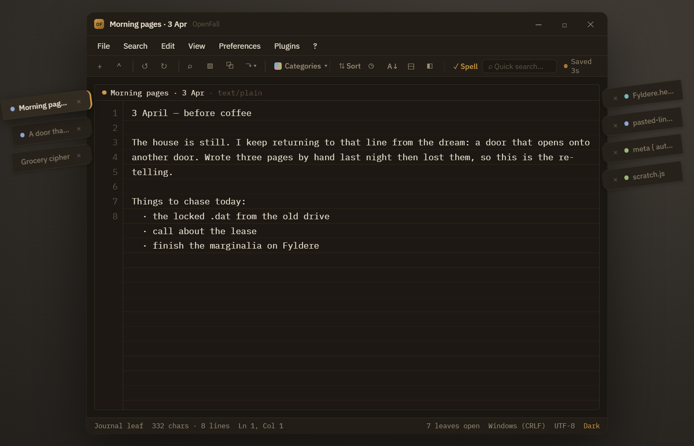
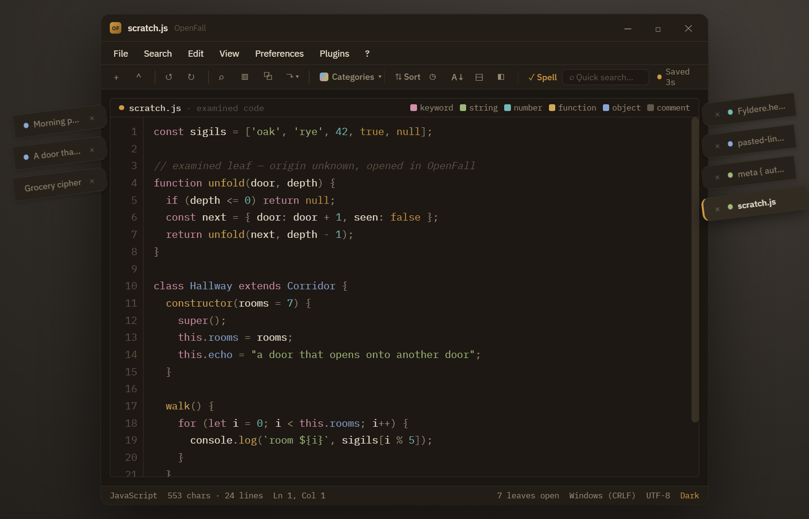
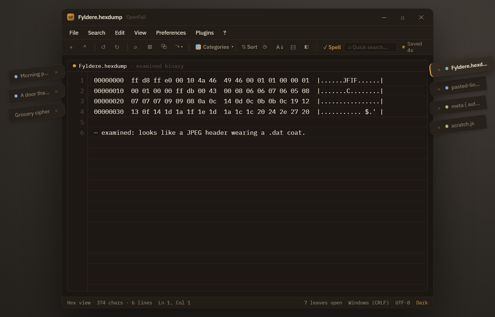
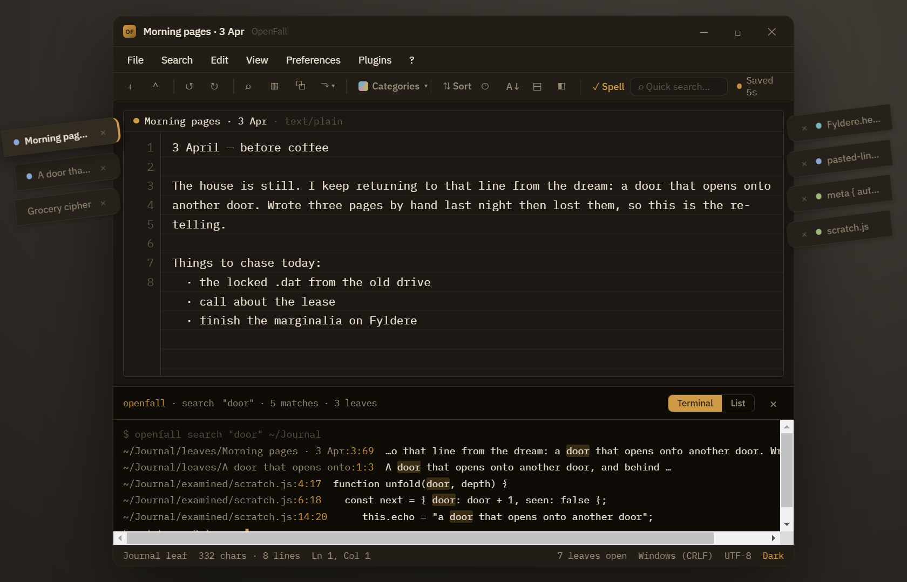
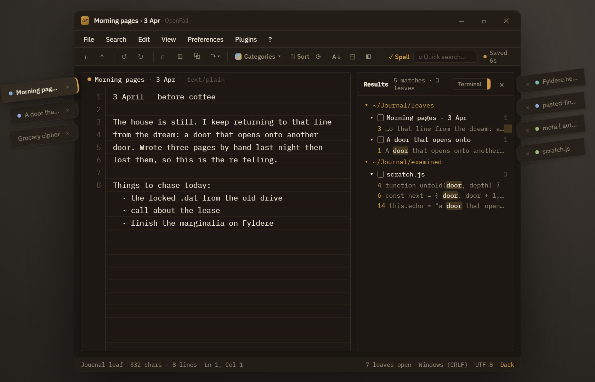
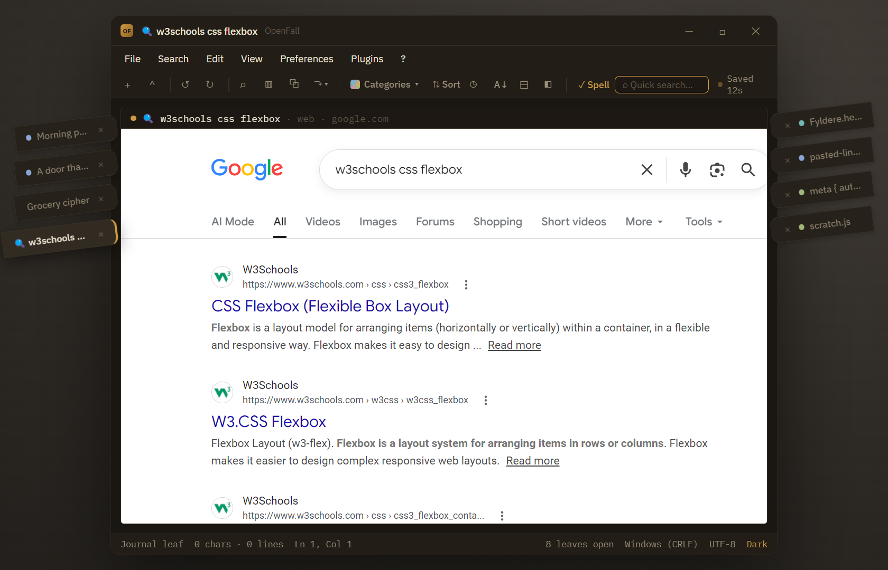
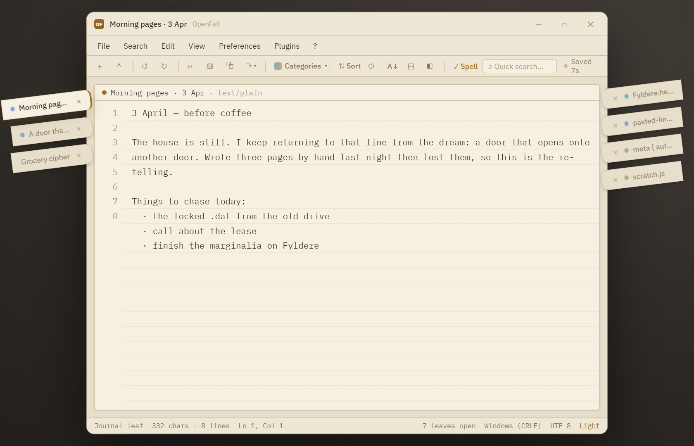

<p align="center"></p>

<h1 align="center">OpenFall</h1>

<p align="center"><em>An autosaving digital journal and odd-ball file examiner. Your documents are <strong>leaves</strong>, and they never get lost.</em></p>

<p align="center">
  
  
  
  
</p>

OpenFall is a desktop text editor with two ideas at its core:

1. **Autosave everything, always.** Every open document (a *leaf*) is mirrored to disk on an interval. Nothing is lost between sessions; leaves persist across restarts and can be exported to other formats.
2. **Leaves, not tabs.** Instead of tabs along the top, open documents are **angled bookmark ribbons** that jut from the left and right edges of the window, past a transparent border, tilted up-and-outward like bookmarks fanning out of a book. They **self-name from their first words** and can be double-clicked to rename.

It is also good at *examining* unusual files: code leaves render with syntax highlighting, odd binaries show a hex view, and search results appear as a **Terminal** console or a vertical **List** ("HTML breakdown") tree.

<p align="center"></p>

## The name

**OpenFall** = **Open** (open source) + **Fall** (the season the leaves turn and let go). It is named for its own *leaves*: the documents that hang off the window like leaves off a branch. Open-source, and a little autumnal.

## Status: alpha

This is an early **alpha**. The core is real and works: autosave, the leaf model, the examiner, search, multi-window, themes, and a sandboxed web leaf, all backed by a unit and integration test suite. Expect rough edges; builds are unsigned, the visual polish is still settling, and APIs may change. Feedback and issues are very welcome.

## Features

- **Signature bookmark leaves:** two rails of tilted ribbons overhanging a transparent window edge; the active leaf juts further with a brass accent.
- **Autosave** on a configurable interval (10s / 30s / 1min / 5min) to a directory you choose; state survives a full restart.
- **Self-naming leaves** from their first words; double-click to rename (the name then sticks).
- **Code examiner:** read-only, syntax-highlighted view for code leaves, with a color legend.
- **Content-aware highlighting:** a *note* that looks like code gets live, **editable** syntax highlighting (named code files stay a read-only examiner).
- **Odd-ball file examiner:** paste or open something strange and read it as a hex dump.
- **Other View:** split the workspace into two independent editor panes.
- **Separate View / Join View:** pop a leaf into its own window and send leaves between windows, with a shared, synced store.
- **Search, two ways:** Find and Transform (Search / Replace / Remove / Add, with Match case / Whole word / Regex), shown as a **Terminal** dock or a vertical **List** tree.
- **Web Quick Search:** a locked-down browser leaf, with a choice of search engine.
- **Categories**, **Sort**, **Export As** (`.txt .md .html .pdf .json .rtf`), **Dark / Light / System** themes, spellcheck, line numbers, word wrap, and zoom.

### Examine anything

Code leaves get syntax highlighting and a legend; renamed-by-hand binaries reveal themselves in a hex view.

| Code examiner | Odd-ball file examiner |
|:---:|:---:|
|  |  |

### Search: Terminal or HTML-breakdown

Run a search across your leaves and read the results the way you like: a **Terminal** console of `path:line:col` hits, or a vertical **List** tree grouped by folder, leaf, and match.

| Terminal | List (HTML breakdown) |
|:---:|:---:|
|  |  |

### A browser leaf, sandboxed

Type into Quick Search and OpenFall opens results in a **locked-down web leaf**, a sandboxed view that lives right beside your notes. (This is *web* search; it never touches the contents of your leaves.)

<p align="center"></p>

### Light and dark

Dark by default; flip to Light or Match System at any time.

<p align="center"></p>

## Download and run (alpha)

Grab a build from the [**Releases**](../../releases) page:

| Client | What you get |
|--------|--------------|
| **Windows installer** | `OpenFall Setup *.exe`, a standard NSIS install |
| **Windows portable** | `OpenFall *.exe`, a single file, just run it, no install |
| **Linux** | `openfall-*.tar.gz` (AppImage and `.deb` build on a Linux host) |
| **Portable (any OS)** | `index.html`, one self-contained file, runs offline in any modern browser |

## Build from source

```bash
npm install
npm run dev            # web app at http://localhost:5173
npm run dev:electron   # the desktop app (Vite + Electron, hot reload)

npm run package:win    # Windows installer + portable .exe  -> release/
npm run package:linux  # Linux tar.gz (+ AppImage/deb on Linux)
npm run build:portable # single-file portable client        -> dist-portable/index.html

npm test               # Vitest unit + integration suite
npm run typecheck
```

## How it works

One React and TypeScript renderer (Vite, Zustand for state, CSS custom properties for theming) runs behind a single `PlatformAdapter` seam with two backends: **Electron** (a frameless, transparent window with real-filesystem autosave) and **web** (localStorage plus the File System Access API). The same renderer also bundles to one self-contained `index.html` for the portable client.

```
src/
  components/   React UI (leaves, editor, search, dialogs, ...)
  state/        Zustand stores plus persistence orchestration
  lib/          pure logic: tokenize, leaf-naming, search, export, seed
  platform/     the PlatformAdapter seam (web plus electron)
electron/       main process plus preload (transparent window, app:// protocol, fs autosave)
```

## Credits

Created by **[DatJavaClass](https://github.com/DatJavaClass)**, with **Claude** (Anthropic) assisting on implementation. Mascot: *Codeman*.

## License

[MIT](LICENSE).
